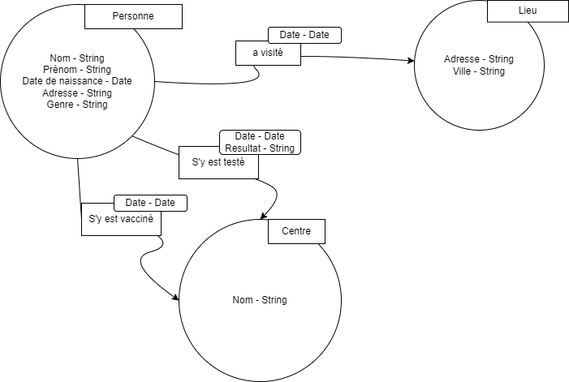
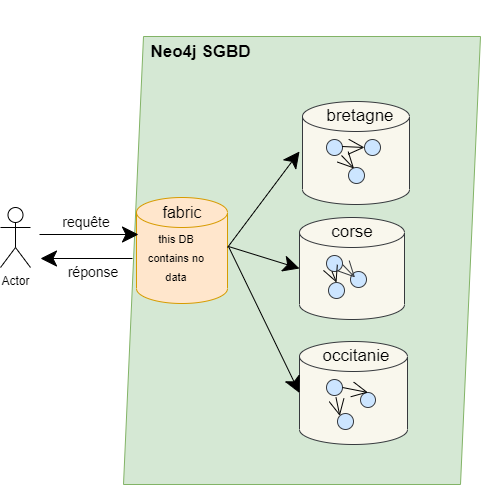
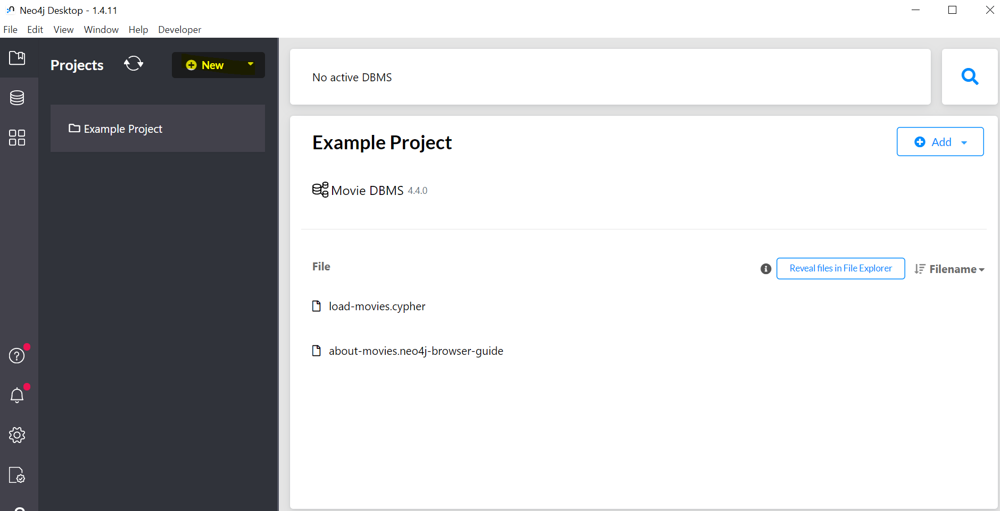
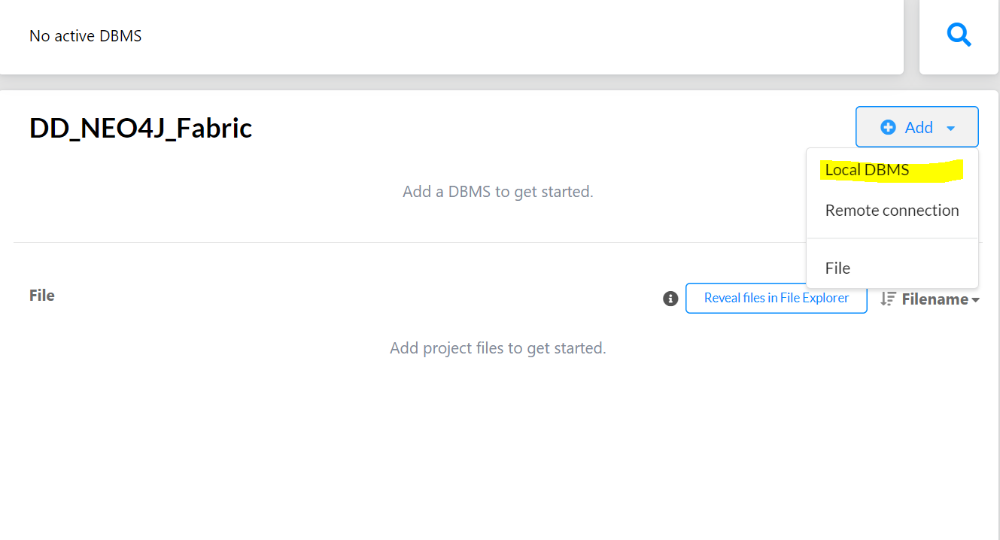
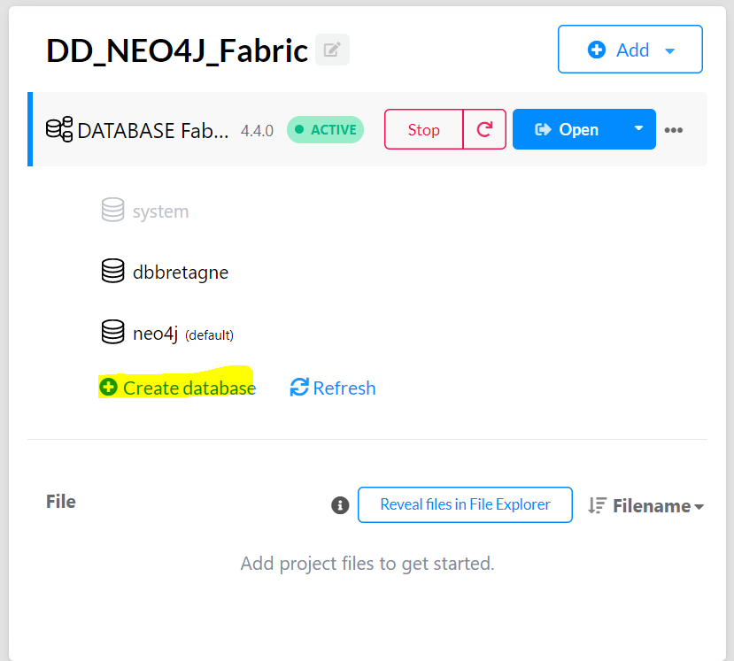
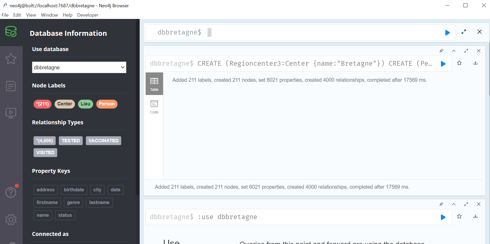

# DD_NEO4J

## Auteurs 
- Diane CONFE
- Yao Arnaud AKOTO
- MiaoMiao CHEN 
- Sophie GADREY


## Projet DD : La distribution des données dans Neo4j 

Nous avons choisi de travailler sur le sujet de la distribution des données dans Neo4j. 
Neo4j étant un SGBD (Système de Gestion de Bases de Données) orienté graphe, nous allons dans un premier temps définir succintement ce qu'est une base de données orientée graphe. Dans un second temps, nous définirons le concept de données distribuées. Ensuite, nous appliquerons la distribution des données dans Neo4j à l'aide d'un exemple de code que nous commenterons. Pour finir, nous tenterons d'implémenter la distribution des données dans Neo4j. 

### Introduction

#### Définition d'une base de données orientée graphe
Une base de données orientée graphe met en avant les relations entre les entités. Une telle base de données est définie par 3 composants [1] :
- les noeuds qui représentent les entités tels que des personnes, des produits, des gares, etc.
- les relations qui lient les noeuds entre eux. Les relations sont orientées, ce sont des arcs. Elles ont des propriétés qui définissent le lien entre les noeuds qu'elles relient. 
- les contraintes appliquées sur les noeuds et les relations.

#### Définition du concept de données distribuées
Une base de données distribuée (Distributed DBMS) est un "système gérant une collection de base de données logiquement reliées et distribuées sur différents sites en fournissant un moyen d'accès rendant la distribution transparente [2]".

### Neo4j Fabric 

Neo4j est une base de données de graphes qui permet d’exploiter des données mais aussi les relations entre elles. A la différence des autres SGBD, Neo4j est dite native car la couche de stockage initiale est un graphe connecté. L’interrogation des données est donc plus rapide car Neo4j calcule les jointures au moment de l'écriture des données et non pendant leur lecture. Les requêtes se font au travers de Cypher, un langage de requête de graphe. 

Neo4j propose dans sa version 4.0, une fonctionnalité appelée _**Fabric**_ qui permet d’interroger plusieurs bases de données de graphes stockées dans un même ou plusieurs SGBD à l’aide d’une seule requête Cypher. 
Fabric est en réalité une base de données virtuelle (qui ne contient aucune donnée). Elle est considérée comme un proxy de base de données. En d’autres termes, la requête Cypher qu'elle reçoit est traitée par les bases de données de graphes et non par elle. Fabric se charge uniquement de transférer la requête aux bases de données de graphe appropriées.

#### Modes de fonctionnement de Fabric

Il existe 2 modes de fonctionnement de _Fabric_ : 

- **Sharding** : qui permet de diviser un graphe en plusieurs bases de données de graphes. Ces graphes peuvent être stockés sur le même serveur ou sur des serveurs différents.Ce mode de fonctionnement est très pratique car il permet de travailler sur des données de plus petite taille tout en conservant les performances souhaitées par les utilisateurs. Aussi, il réduit de façon importante la latence des requêtes. 

- **Federation** : à la différence de Sharding, Federation permet de faire des requêtes sur des données disponibles dans des sources distribuées en rassemblant ces données. Il est aussi très pratique car il peut s'appliquer dans des bases de données de graphe présentant même des schémas différents notamment dans des bases de données d'entreprise disposant par exemple de plusieurs données informatiques, de finances, de ressources humaines etc..

#### Modes de déploiement de Fabric
   
Fabric peut être déployé de trois façons : 

- **Déploiement Fabric mono-instance** : dans ce mode, Fabric est déployé sur une seule instance et les différents graphes peuvent être associés à des bases de données locales. L'ensemble se trouve dans un seul SGBD Neo4j.

- **Déploiement Fabric sans point de défaillance unique** : dans ce dernier, on a 2 instances Fabric situées chacune dans un SGBD Neo4j et qui accèdent toutes deux à un même cluster de graphes.

- **Déploiement Fabric multi-clusters sans point de défaillance unique**: Il est similaire au déploiement sans point de défaillance unique à la différence qu'on note au minimum 2 clusters et chacune des 2 instances Fabric a accès à ces clusters. 


### Scénario d'exemple 
Nous avons choisi de travailler sur un scénario reprenant le fonctionnement de l'application TousAntiCovid. 
Afin de simuler le sharding sur plusieurs bases de données, nous avons opté pour une distribution des données de l'application par région. Nous avons donc créé 13 bases de données pour 13 régions. 
Dans le répertoire Diagrams du dépôt Git se trouve un graphe répresentant la structuration des données que nous avons choisi d'utiliser. 
Afin de ne pas trop complexifier les informations, nous avons choisi de partir sur un graphe avec 3 noeuds, "Personne","Lieu" et "Centre" , et plusieurs relations, "a visité", "s'y est testé" et "s'y est vacciné". Nous n'avons pas mis de contraintes particulières sur les noeuds ou les relations.
Voici le graphe : 



#### Mode de fonctionnement et de déploiement choisis

Comme ce qui a été dit plus haut, nous avons décidé d'utiliser la méthode Sharding comme mode de fonctionnement. Le déploiement Fabric mono-instance a été choisi comme mode de déploiement. Cela est résumé dans le schéma ci-dessous. Ce dernier a été fait en se basant uniquement sur 3 exemples de régions parmi les 13.





La base de données Fabric et les bases de données de graphe des différentes régions (les _shards_) sont toutes situées dans un seul SGBD Neo4j.
Lorsqu'une requête est envoyée par un utilisateur, elle atteint d'abord la base de données Fabric qui se charge de la transmettre à l'instance ou aux instances de bases de données de graphes correspondante(s). Chacune d'elles transfère par la suite sa réponse à Fabric. Une fois l'ensemble des réponses reçues, Fabric les unifie et envoie la réponse unifiée à l'utilisateur.

#### Procédure de mise en place des données

Un programme Java a été écrit afin de créer automatiquement les 13 datasets en Cypher.

Voici le lien vers les programmes : 
https://gitlab.istic.univ-rennes1.fr/sgadrey/dd_neo4j/-/tree/main/DataGenerator/src/fr/istic/m2/dd/neo4j/dataset

Il a été choisi d'avoir 1 centre par région. 

#### Procédure de mise en place du projet sur NEO4J

Dans un premier temps, il faut créer un nouveau projet dans Neo4j Desktop.



Il faut ensuite ajouter un LOCAL DBMS afin de gérer les bases de données que l'on souhaite créer.



On veut créer 13 bases de données et les lier avec la technologie Fabric pour mettre un place le sharding.
Pour cela, lancer le DBMS puis ajouter les bases de données en cliquant sur "Create database".



Une fois les bases de données créées, il faut ajouter Fabric. Pour cela, il faut aller dans les Settings du DBMS et ajouter un code similaire à celui-ci : 

```
#fabric config
fabric.database.name=fabric
fabric.graph.0.uri=neo4j://localhost:7687
fabric.graph.0.database= dbauvergne
fabric.graph.0.name=region1
 
fabric.graph.1.uri=neo4j://localhost:7687
fabric.graph.1.database= dbbourgogne
fabric.graph.1.name=region2
fabric.graph.2.uri=neo4j://localhost:7687 
fabric.graph.2.database= dbbretagne
fabric.graph.2.name=region3
fabric.graph.3.uri=neo4j://localhost:7687 
fabric.graph.3.database= dbcentreval
fabric.graph.3.name=region4
 
fabric.graph.4.uri=neo4j://localhost:7687 
fabric.graph.4.database= dbcorse
fabric.graph.4.name=region5
fabric.graph.5.uri=neo4j://localhost:7687 
fabric.graph.5.database= dbgrandest
fabric.graph.5.name=region6
fabric.graph.6.uri=neo4j://localhost:7687 
fabric.graph.6.database= dbhautsdefrance
fabric.graph.6.name=region7
 
fabric.graph.7.uri=neo4j://localhost:7687 
fabric.graph.7.database= dbiledefrance
fabric.graph.7.name=region8
 
fabric.graph.8.uri=neo4j://localhost:7687
fabric.graph.8.database= dbnormandie
fabric.graph.8.name=region9
fabric.graph.9.uri=neo4j://localhost:7687 
fabric.graph.9.database= dbnouvellequitaine
fabric.graph.9.name=region10
fabric.graph.10.uri=neo4j://localhost:7687 
fabric.graph.10.database= dboccitanie
fabric.graph.10.name=region11
 
fabric.graph.11.uri=neo4j://localhost:7687 
fabric.graph.11.database= dbpaysdelaloire
fabric.graph.11.name=region12
fabric.graph.12.uri=neo4j://localhost:7687 
fabric.graph.12.database= dbprovence
fabric.graph.12.name=region13
```

Il faut ensuite ouvrir le NEO4J Browser et commencer à ajouter les données dans les bases créées à partir des scripts générés. 



Une fois les données ajoutées dans les bases, il est possible de se placer sur la base Fabric et d'y formuler des requêtes CYPHER. Ces requêtes CYPHER pourront agir sur une base de données ou plusieurs.

### Exemple de code
```
// Nombres de personnes étant vacinnées en Bretagne et Normandie en 2021
USE fabric.region3
MATCH (p:Person) -[v:VACCINATED]-> (c:Center{name:"Bretagne"})
WHERE v.date > date("2021-01-01") AND v.date < date("2022-01-01")
RETURN c.name as center, count(p) as num
UNION
USE fabric.region9
MATCH (p:Person) -[v:VACCINATED]-> (c:Center{name:"Normandie"})
WHERE v.date > date("2021-01-01") AND v.date < date("2022-01-01")
RETURN c.name as center, count(p) as num

// Nombres de personnes étant nées après l'an 2000, et étant vaccinées en 2021 dans tous les régions
UNWIND fabric.graphIds() AS graphId 
CALL {
    USE fabric.graph(graphId)
    MATCH (p:Person) -[v:VACCINATED]-> (c:Center)
    WHERE v.date > date("2021-01-01") AND v.date < date("2022-01-01")
    AND p.birthdate > date("2000-01-01")
    RETURN c.name as center, count(p) as num
}
RETURN center, num

// Total de cas positif de tous les régions
UNWIND fabric.graphIds() AS graphId 
CALL {
    USE fabric.graph(graphId)
    MATCH (p:Person) -[:TESTED {status:"Positif"}]-> (c:Center)
    RETURN count(p) as num
}
RETURN sum(num) AS Positif

// Les personnes de Bretagne ayant visité le même lieu après le 12 octobre 2021 et ayant été testées positives
USE fabric.region3
MATCH (p:Person) -[t:TESTED {status:"Positif"}]-> (Center {name:"Bretagne"}) 
WHERE t.date >date("2021-10-12")
RETURN p.firstname AS firstname, p.lastname AS lastname
UNION ALL
USE fabric.region3
MATCH (p:Person)-[v:VISITED]->(Lieu {city:"Rennes"})
WHERE v.date >date("2021-10-12")
RETURN p.firstname AS firstname, p.lastname AS lastname

// Trouver automatiquement les cas contact
UNWIND fabric.graphIds() AS graphId 
CALL {
    USE fabric.graph(graphId)
    MATCH (p2:Person)-
    [:VISITED]->(l:Lieu) <-[v:VISITED]-(p:Person)-[t:TESTED {status:"Positif"}]-> (c:Center)
    WHERE (t.date > date("2020-01-01") AND t.date < date("2022-03-01") 
    AND v.date >= t.date   AND  v.date <= t.date + duration("P7D")) OR (p2.address = p.address)

    RETURN DISTINCT p2 AS contact, c
}
RETURN contact.firstname AS name , contact.lastname AS lastname , contact.address AS address, c.name AS centre
```
#### [Toutes les requêtes](https://gitlab.istic.univ-rennes1.fr/sgadrey/dd_neo4j/-/blob/main/Cypher/requetes.cql)

### Procédure de lancement avec DOCKER

1. Cloner le projet pour récupérer l'ensemble des fichiers.
2. Ouvrir le dossier dd_neo4j avec Visual Studio Code **ou** Se placer dans le répertoire dd_neo4j à la racine du projet.
3. Sur VSCode, exécuter la commande docker-compose up à partir du fichier docker-compose.yml **ou** Exécuter la commande docker-compose up directement dans un terminal.
4. Une fois docker lancé, ouvrir un navigateur à l'adresse http://localhost:7474/browser/ 
5. Se connecter avec l'id neo4j et le mot de passe Neo4j.
6. Tester les requêtes CYPHER.


### Bibliographie
- [1] J. Weber and R. V. Bruggen,_ Graph Database for Dummies, Neo4j Special Edition_, 2020.
- [2] R. J. Chevance, _Conservatoire National des arts et métiers_, "Bases de données distribuées et fédérées", Mars 2003. [En ligne]. [Accès le 22/02/2022] : http://deptinfo.cnam.fr/Enseignement/CycleSpecialisation/ISA/ISCS/Chevance/Bases%20de%20donn%E9es%20distribu%E9es%20et%20f%E9d%E9r%E9es.pdf.
- https://neo4j.com.  [En ligne]. [Accès le 25/02/2022]
